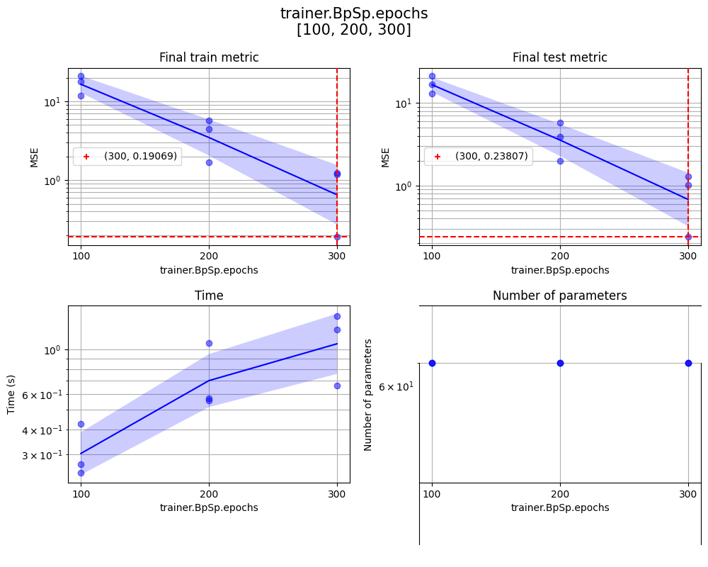
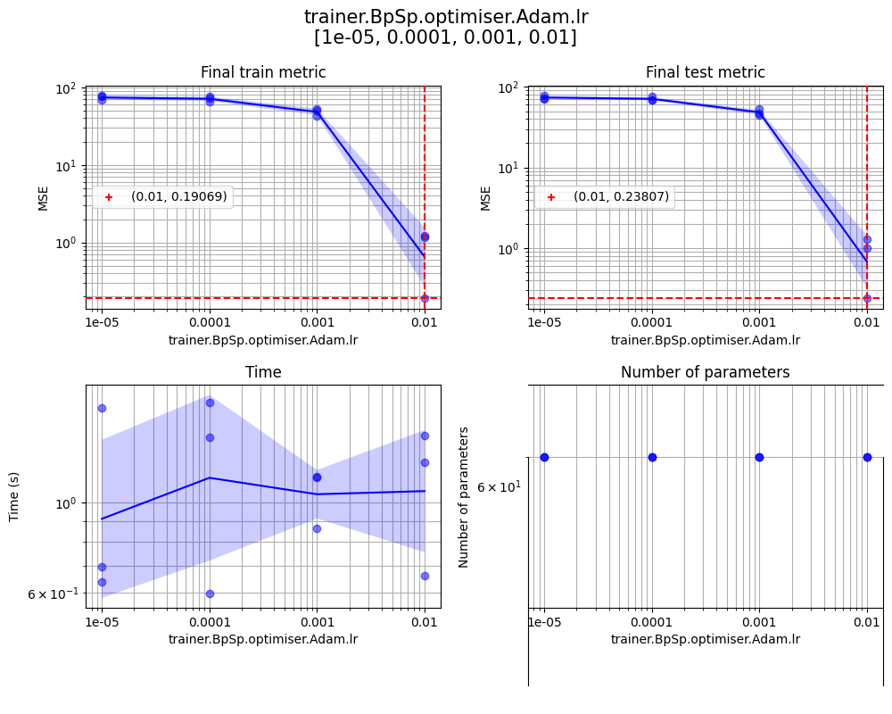

# Sweep results

## Summary

Key                                    | Value                                 
-------------------------------------- | --------------------------------------
`# experiments`                        | `36`                                  
Target metric                          | `test.min`                            
Best result                            | `0.23807397842407227`                 
Best params/seed                       | `seed=2, trainer.BpSp.epochs=300, trainer.BpSp.optimiser.Adam.lr=0.01`
Model                                  | `LinearModel(num_params=60)`          
Model name                             | `dLi5o10te200tr200ts0.0x0.0_lM_mLeIpI_tBb100e300lCle1E-05oAol0.01_s2`
Train metrics                          | `start = 68.86100, end =  0.19069, max = 68.86100, min =  0.19069`
Test metrics                           | `start = 72.84058, end =  0.23807, max = 72.84058, min =  0.23807`
Training duration                      | `1.4635 seconds`                      
Number of parameters                   | `60`                                  
`--seed`                               | `2`                                   
`--trainer.BpSp.epochs`                | `300`                                 
`--trainer.BpSp.optimiser.Adam.lr`     | `0.01`                                
Mean (best params)                     | `0.8471058718363444`                  
Mean (all)                             | `52.50547343201107`                   
STD (best params)                      | `0.5464423523745591`                  
STD (all)                              | `28.000295887974016`                  

## Sweep configuration

Key                                    | Value                                 
-------------------------------------- | --------------------------------------
`trainer.BpSp.epochs`                  | `[100, 200, 300]`                     
`trainer.BpSp.optimiser.Adam.lr`       | `[1e-05, 0.0001, 0.001, 0.01]`        
`seeds`                                | `[1, 2, 3]`                           

## Metrics

[Best metrics (JSON)](../../train/dLi5o10te200tr200ts0.0x0.0_lM_mLeIpI_tBb100e300lCle1E-05oAol0.01_s2/metrics.json)






## All results

Rank       | `test.min` | `seed`     | `trainer.BpSp.epochs` | `trainer.BpSp.optimiser.Adam.lr` | Model name
---------- | ---------- | ---------- | --------------------- | -------------------------------- | ----------
1          |    0.23807 |          2 |                   300 |                             0.01 | `dLi5o10te200tr200ts0.0x0.0_lM_mLeIpI_tBb100e300lCle1E-05oAol0.01_s2`
2          |    1.00876 |          3 |                   300 |                             0.01 | `dLi5o10te200tr200ts0.0x0.0_lM_mLeIpI_tBb100e300lCle1E-05oAol0.01_s3`
3          |    1.29448 |          1 |                   300 |                             0.01 | `dLi5o10te200tr200ts0.0x0.0_lM_mLeIpI_tBb100e300lCle1E-05oAol0.01_s1`
4          |    1.97951 |          2 |                   200 |                             0.01 | `dLi5o10te200tr200ts0.0x0.0_lM_mLeIpI_tBb100e200lCle1E-05oAol0.01_s2`
5          |    3.90099 |          3 |                   200 |                             0.01 | `dLi5o10te200tr200ts0.0x0.0_lM_mLeIpI_tBb100e200lCle1E-05oAol0.01_s3`
6          |    5.84714 |          1 |                   200 |                             0.01 | `dLi5o10te200tr200ts0.0x0.0_lM_mLeIpI_tBb100e200lCle1E-05oAol0.01_s1`
7          |   13.04341 |          2 |                   100 |                             0.01 | `dLi5o10te200tr200ts0.0x0.0_lM_mLeIpI_tBb100e100lCle1E-05oAol0.01_s2`
8          |   16.74471 |          3 |                   100 |                             0.01 | `dLi5o10te200tr200ts0.0x0.0_lM_mLeIpI_tBb100e100lCle1E-05oAol0.01_s3`
9          |   21.47326 |          1 |                   100 |                             0.01 | `dLi5o10te200tr200ts0.0x0.0_lM_mLeIpI_tBb100e100lCle1E-05oAol0.01_s1`
10         |   45.03642 |          2 |                   300 |                            0.001 | `dLi5o10te200tr200ts0.0x0.0_lM_mLeIpI_tBb100e300lCle1E-05oAol0.001_s2`
11         |   47.12824 |          3 |                   300 |                            0.001 | `dLi5o10te200tr200ts0.0x0.0_lM_mLeIpI_tBb100e300lCle1E-05oAol0.001_s3`
12         |   52.93597 |          2 |                   200 |                            0.001 | `dLi5o10te200tr200ts0.0x0.0_lM_mLeIpI_tBb100e200lCle1E-05oAol0.001_s2`
13         |   53.29376 |          1 |                   300 |                            0.001 | `dLi5o10te200tr200ts0.0x0.0_lM_mLeIpI_tBb100e300lCle1E-05oAol0.001_s1`
14         |   54.22886 |          3 |                   200 |                            0.001 | `dLi5o10te200tr200ts0.0x0.0_lM_mLeIpI_tBb100e200lCle1E-05oAol0.001_s3`
15         |   60.66983 |          1 |                   200 |                            0.001 | `dLi5o10te200tr200ts0.0x0.0_lM_mLeIpI_tBb100e200lCle1E-05oAol0.001_s1`
16         |   62.10279 |          2 |                   100 |                            0.001 | `dLi5o10te200tr200ts0.0x0.0_lM_mLeIpI_tBb100e100lCle1E-05oAol0.001_s2`
17         |   62.36901 |          3 |                   100 |                            0.001 | `dLi5o10te200tr200ts0.0x0.0_lM_mLeIpI_tBb100e100lCle1E-05oAol0.001_s3`
18         |   68.61455 |          3 |                   300 |                           0.0001 | `dLi5o10te200tr200ts0.0x0.0_lM_mLeIpI_tBb100e300lCle1E-05oAol0.0001_s3`
19         |   69.15182 |          1 |                   100 |                            0.001 | `dLi5o10te200tr200ts0.0x0.0_lM_mLeIpI_tBb100e100lCle1E-05oAol0.001_s1`
20         |   69.19665 |          2 |                   300 |                           0.0001 | `dLi5o10te200tr200ts0.0x0.0_lM_mLeIpI_tBb100e300lCle1E-05oAol0.0001_s2`
21         |   69.66192 |          3 |                   200 |                           0.0001 | `dLi5o10te200tr200ts0.0x0.0_lM_mLeIpI_tBb100e200lCle1E-05oAol0.0001_s3`
22         |   70.38937 |          2 |                   200 |                           0.0001 | `dLi5o10te200tr200ts0.0x0.0_lM_mLeIpI_tBb100e200lCle1E-05oAol0.0001_s2`
23         |   70.72441 |          3 |                   100 |                           0.0001 | `dLi5o10te200tr200ts0.0x0.0_lM_mLeIpI_tBb100e100lCle1E-05oAol0.0001_s3`
24         |   71.22170 |          3 |                   300 |                            1e-05 | `dLi5o10te200tr200ts0.0x0.0_lM_mLeIpI_tBb100e300lCle1E-05oAol1E-05_s3`
25         |   71.41795 |          3 |                   200 |                            1e-05 | `dLi5o10te200tr200ts0.0x0.0_lM_mLeIpI_tBb100e200lCle1E-05oAol1E-05_s3`
26         |   71.60025 |          2 |                   100 |                           0.0001 | `dLi5o10te200tr200ts0.0x0.0_lM_mLeIpI_tBb100e100lCle1E-05oAol0.0001_s2`
27         |   71.61471 |          3 |                   100 |                            1e-05 | `dLi5o10te200tr200ts0.0x0.0_lM_mLeIpI_tBb100e100lCle1E-05oAol1E-05_s3`
28         |   72.16727 |          2 |                   300 |                            1e-05 | `dLi5o10te200tr200ts0.0x0.0_lM_mLeIpI_tBb100e300lCle1E-05oAol1E-05_s2`
29         |   72.39123 |          2 |                   200 |                            1e-05 | `dLi5o10te200tr200ts0.0x0.0_lM_mLeIpI_tBb100e200lCle1E-05oAol1E-05_s2`
30         |   72.61553 |          2 |                   100 |                            1e-05 | `dLi5o10te200tr200ts0.0x0.0_lM_mLeIpI_tBb100e100lCle1E-05oAol1E-05_s2`
31         |   75.67328 |          1 |                   300 |                           0.0001 | `dLi5o10te200tr200ts0.0x0.0_lM_mLeIpI_tBb100e300lCle1E-05oAol0.0001_s1`
32         |   76.76770 |          1 |                   200 |                           0.0001 | `dLi5o10te200tr200ts0.0x0.0_lM_mLeIpI_tBb100e200lCle1E-05oAol0.0001_s1`
33         |   77.87912 |          1 |                   100 |                           0.0001 | `dLi5o10te200tr200ts0.0x0.0_lM_mLeIpI_tBb100e100lCle1E-05oAol0.0001_s1`
34         |   78.39949 |          1 |                   300 |                            1e-05 | `dLi5o10te200tr200ts0.0x0.0_lM_mLeIpI_tBb100e300lCle1E-05oAol1E-05_s1`
35         |   78.60457 |          1 |                   200 |                            1e-05 | `dLi5o10te200tr200ts0.0x0.0_lM_mLeIpI_tBb100e200lCle1E-05oAol1E-05_s1`
36         |   78.81033 |          1 |                   100 |                            1e-05 | `dLi5o10te200tr200ts0.0x0.0_lM_mLeIpI_tBb100e100lCle1E-05oAol1E-05_s1`

## `git add`

```

cd results/sweep/dLi5o10te200tr200ts0.0x0.0lMmLeIpItBb100e1,2,300lCle1E-05oAol,1E-0.0001,.001,.01,5s1,2,3
git add -f results.md
git add -f ../../train/dLi5o10te200tr200ts0.0x0.0_lM_mLeIpI_tBb100e300lCle1E-05oAol0.01_s2/metrics.json
git add -f ../../train/dLi5o10te200tr200ts0.0x0.0_lM_mLeIpI_tBb100e300lCle1E-05oAol0.01_s2/metrics.png
git add -f trainer.BpSp.epochs.png
git add -f trainer.BpSp.optimiser.Adam.lr.png
cd ../../..

```

## [`README.md`](../../../README.md) include

```md

[`[ full_sweep_results ]`](results/sweep/dLi5o10te200tr200ts0.0x0.0lMmLeIpItBb100e1,2,300lCle1E-05oAol,1E-0.0001,.001,.01,5s1,2,3/results.md)


```

## `sweep` command

```
juml sweep --model LinearModel --dataset LinearDataset --dataset.LinearDataset.input_dim 5 --dataset.LinearDataset.output_dim 10 --print_level 1 --sweep.seeds 1 2 3 --sweep.params {"trainer.BpSp.epochs":[100,200,300],"trainer.BpSp.optimiser.Adam.lr":[1e-5,1e-4,1e-3,1e-2]} --sweep.log_x trainer.BpSp.optimiser.Adam.lr --sweep.devices [[],[],[],[],[],[]] --sweep.no_cache
```
